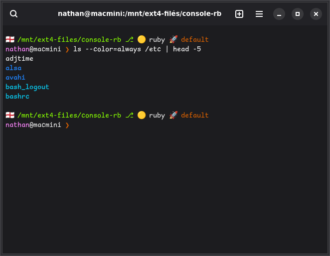

# console-rb

A Ruby GTK4 port of [GNOME Console (KGX)](https://gitlab.gnome.org/GNOME/console)
— a simple terminal emulator for casual command-line work.



Built on the `gtk4`, `adwaita` and `vte4` gems from
[ruby-gnome](https://github.com/ruby-gnome/ruby-gnome), in the declarative
memoized-widget style: every widget is a memoized method that configures itself
in a `tap` block, and one `build` method assembles the tree.

## Running it

With Nix:

```sh
nix run github:ruby-gtk-project/console-rb
```

From a checkout:

```sh
nix develop      # ruby 3.3 + the gems + the GTK/VTE/Adwaita stack
rake schema      # compile the GSettings schema into data/schemas
./bin/console-rb
```

`nix build` produces a self-contained `result/bin/console-rb`.

## Command line

```
console-rb [OPTION…] [-e|-- COMMAND [ARGUMENT…]]

  --tab                        open a tab in the running window
  -e, --command COMMAND        run COMMAND instead of the shell
  --working-directory DIRNAME  start in DIRNAME
  -T, --title TITLE            set the initial window title
  --set-shell SHELL            persist the shell to launch
  --set-scrollback LINES       persist the scrollback length
  --version, --about
```

Positional arguments are directories, one tab each. It is a single-instance
application, so a second invocation hands its arguments to the running one.

## Keyboard shortcuts

| | |
|---|---|
| New window / new tab | <kbd>Ctrl</kbd>+<kbd>Shift</kbd>+<kbd>N</kbd> / <kbd>T</kbd> |
| Close tab | <kbd>Ctrl</kbd>+<kbd>Shift</kbd>+<kbd>W</kbd> |
| Copy / paste | <kbd>Ctrl</kbd>+<kbd>Shift</kbd>+<kbd>C</kbd> / <kbd>V</kbd> |
| Find | <kbd>Ctrl</kbd>+<kbd>Shift</kbd>+<kbd>F</kbd> |
| Zoom in / out / reset | <kbd>Ctrl</kbd>+<kbd>+</kbd> / <kbd>−</kbd> / <kbd>0</kbd> |
| Show all tabs | <kbd>Ctrl</kbd>+<kbd>Shift</kbd>+<kbd>O</kbd> |
| Fullscreen | <kbd>Ctrl</kbd>+<kbd>Shift</kbd>+<kbd>F11</kbd> |

<kbd>Ctrl</kbd>+scroll zooms.

## What it does

Tabs with an overview and tear-off, search, link detection and opening, "show in
files", drag-and-drop of files onto the prompt, a paste confirmation for
multi-line `sudo` commands, light/dark/system theming, three colour palettes,
configurable font, scrollback and bell, and header-bar tinting for root, remote
and container sessions.

## Layout

```
bin/console-rb          entry point
lib/console_rb/
  application.rb        actions, accelerators, command line, single instance
  window.rb             header bar, tab bar, overview, win.* actions
  pages.rb              AdwTabView and the close-confirmation flow
  tab.rb                search bar + terminal + exit banner, spawning
  terminal.rb           VteTerminal, link matching, context menu, term.* actions
  settings.rb           GSettings and everything derived from it
  train.rb              per-tab process tracking; the shared poll timer
  process_info.rb       /proc reading
  livery.rb palette.rb  colour schemes
  regex.rb shortcuts.rb binding workarounds
data/                   GSettings schema, stylesheet, desktop file
test/                   integration and action suites
```

`PORTING.md` records what changed from the C original, what was deliberately
left out, and the Ruby binding quirks worth knowing about.

## Tests

```sh
rake test     # both suites; needs a display (Xvfb is fine)
rake lint
```

The integration suite spawns a real shell through a pty, types at it and reads
the output back off the terminal grid. The action suite drives every `app.*` and
`win.*` action and opens every dialog.

## Relationship to upstream

This is an independent port in a separate repository under a different
application id (`org.gnome.Console.Rb`), so it installs alongside GNOME Console
rather than replacing it. It is not affiliated with the GNOME project, and
nothing here is intended for contribution upstream — GNOME Console's own
contribution policy prohibits AI-generated content, and this port was written
with AI assistance.

Licensed GPL-3.0-or-later, following the original.
